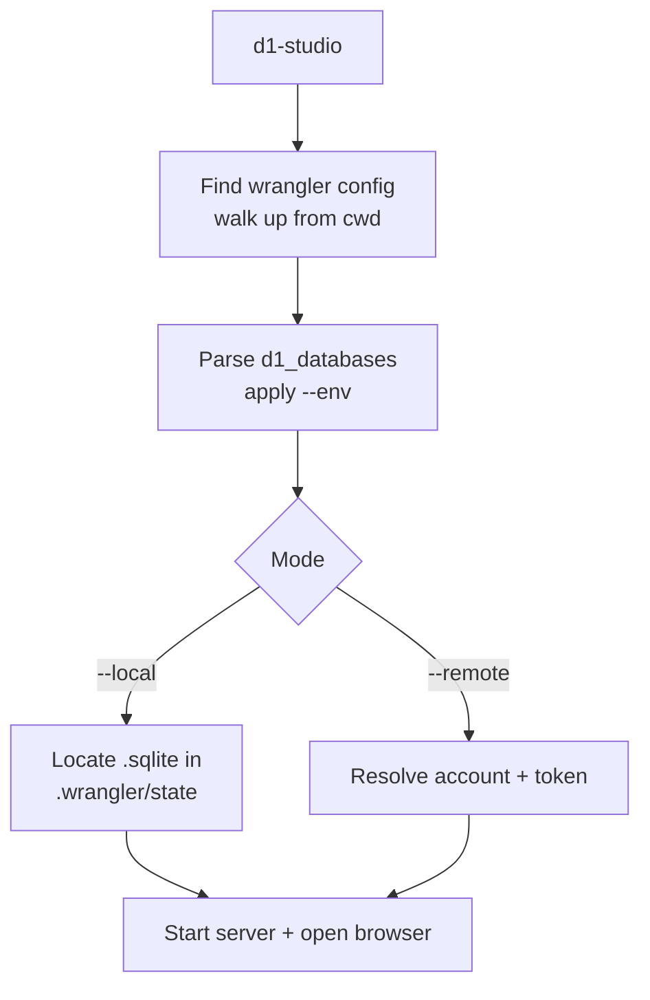
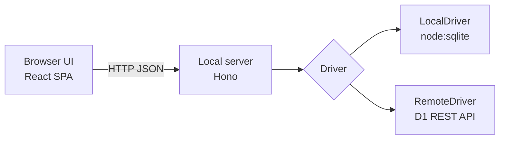

# d1-studio — Product Requirements Document

Sep 24, 2026 · @Iyan Saputra

## Overview

d1-studio is a zero-config CLI that opens a browser-based studio for Cloudflare D1, local or remote, with one command: `npx @iyansr/d1-studio --local` or `npx @iyansr/d1-studio --remote`.

It follows the model of Drizzle Studio and Prisma Studio: a CLI starts a local HTTP server, serves a prebuilt web UI, and opens the browser. Unlike those tools, it needs no ORM, schema file, or config. It reads the project's existing Wrangler config and credentials.

**Problem.** Inspecting D1 today means one of three things: running `wrangler d1 execute` with raw SQL, starting `wrangler dev` and opening Local Explorer, or going to the Cloudflare dashboard. Each is tied to a running dev server, a browser login, or a CLI round-trip per query. There is no single standalone command that works the same way against local and remote databases.

## Goals, non-goals, and success metrics

**Goals**

- Zero config: run inside any Wrangler project and see data within 5 seconds, with no flags beyond `--local` or `--remote`.
- One UI for local and remote D1, with identical features in both modes.
- Safe by default for remote: production edits need explicit opt-in.
- Runs standalone: no `wrangler dev` process, no ORM, no schema file.

**Non-goals (v1)**

- Migrations authoring or schema diffing (read the schema, don't manage it).
- KV, R2, Durable Objects, or other bindings.
- Hosted or multi-user deployment; this is a local developer tool.
- ORM-specific features (Drizzle/Prisma relation views).

**Success metrics**

| Metric | Target |
| --- | --- |
| Time from command to first table rendered (local) | < 3 s |
| Time from command to first table rendered (remote) | < 5 s |
| Projects that start with zero flags or prompts | ≥ 90% of standard Wrangler layouts |
| Grid render for a 100k-row table | < 500 ms per page |
| npm weekly downloads, 3 months after launch | 1,000 |

## Target users and use cases

The primary user is a developer building on Cloudflare Workers with D1, with or without an ORM.

| Use case | Mode | Example |
| --- | --- | --- |
| Check what the Worker wrote during local dev | Local | Inspect rows after a signup test |
| Seed or fix test data | Local | Insert rows, edit a cell, delete junk |
| Debug a production bug | Remote (read-only) | Query a user's records |
| Run a one-off data fix in prod | Remote (write enabled) | Update a flag on 3 rows, with confirmation |
| Understand an unfamiliar schema | Both | View tables, columns, indexes, foreign keys |
| Compare local vs remote data | Both | Switch mode without restarting (v1.1) |

## CLI interface

The command is `d1-studio`, run via `npx @iyansr/d1-studio` or a global install of the scoped package @iyansr/d1-studio, which exposes the d1-studio binary. Exactly one of `--local` or `--remote` selects the mode; with neither, it defaults to `--local`.

| Flag | Default | Description |
| --- | --- | --- |
| `--local` | on | Open the local Miniflare SQLite file |
| `--remote` | off | Connect to deployed D1 via the Cloudflare REST API |
| `--port <n>`, `-p` | `4101` | Port for the studio server |
| `--host <addr>` | `127.0.0.1` | Bind address; never `0.0.0.0` unless set explicitly |
| `--db <name>` | first D1 binding | Binding name or database name when the config has several |
| `--config <path>` | auto-detect | Path to `wrangler.toml`, `wrangler.json` or `wrangler.jsonc` |
| `--env <name>` | none | Wrangler environment (`[env.staging]`) to read bindings from |
| `--persist-to <dir>` | `.wrangler/state` | Local state dir, matching Wrangler's flag |
| `--write` | off in remote, on in local | Allow edits; remote is read-only without it, and with it the CLI asks you to type the database name at startup (skip with --yes in non-interactive runs) |
| `--no-open` | open | Don't launch the browser |

**Port resolution.** `--port` beats the `D1_STUDIO_PORT` env var, which beats the default. If the chosen port is busy, the CLI tries the next 10 ports and prints the one it used; with an explicit `--port`, it fails with a clear error instead.

**Examples**

```bash
npx @iyansr/d1-studio                          # local, first binding, port 4101
npx @iyansr/d1-studio --local --port 5555
npx @iyansr/d1-studio --remote --db prod-db    # read-only
npx @iyansr/d1-studio --remote --write --env staging
D1_STUDIO_PORT=8080 npx @iyansr/d1-studio --remote
```

**Startup output**

```text
d1-studio v1.0.0
  mode      remote (read-only)
  database  prod-db (binding DB, id 3f2a…)
  config    ./wrangler.jsonc
  studio    http://127.0.0.1:4101
```

## Zero-config discovery

The CLI finds the config, the database, and the credentials on its own, and asks only when a choice is genuinely ambiguous.



**1. Config file.** Search the current directory, then each parent up to the git root, for `wrangler.jsonc`, `wrangler.json`, then `wrangler.toml` (Wrangler's own precedence). Parse JSONC with comments and trailing commas allowed.

**2. Database selection.** Read `d1_databases[]` (or `env.<name>.d1_databases[]` with `--env`). Each entry gives `binding`, `database_name`, `database_id`. One entry → use it. Several and no `--db` → interactive picker in the terminal; in a non-TTY, fail with the list of names.

**3a. Local mode.** Look under `<persist-to>/v3/d1/miniflare-D1DatabaseObject/` for `*.sqlite` files. Miniflare derives each file name from the database ID, so the CLI maps binding → file by reproducing that derivation; if that fails, it falls back to listing every file and letting the user pick in the UI. No file found → print "Run `wrangler dev` or `wrangler d1 migrations apply --local` first" and exit 1.

*Example.* A project with two bindings leaves two opaque files on disk, and nothing in the file names says which is which:

```text
wrangler.jsonc
  d1_databases: [
    { binding: "DB",        database_id: "3f2a9c1e-5b7d-4e8a-9c21-7d4e5f6a8b90" },
    { binding: "ANALYTICS", database_id: "b81c0d44-2e6f-4a19-8d3b-0c5e7a9f1d22" }
  ]

.wrangler/state/v3/d1/miniflare-D1DatabaseObject/
  5e1a7c…9f04.sqlite   <- DB or ANALYTICS?
  a93d02…4b7e.sqlite
```

Miniflare stores each D1 database as a Durable Object and names the file after that object's ID, which it derives from the `database_id` with HMAC-SHA256. Community tools reproduce it like this (to verify against current Miniflare source before relying on it):

```ts
import crypto from "node:crypto";

function localD1FileName(databaseId: string): string {
  const key = crypto.createHash("sha256")
    .update("miniflare-D1DatabaseObject").digest();
  const nameHmac = crypto.createHmac("sha256", key)
    .update(databaseId).digest().subarray(0, 16);
  const hmac = crypto.createHmac("sha256", key)
    .update(nameHmac).digest().subarray(0, 16);
  return Buffer.concat([nameHmac, hmac]).toString("hex") + ".sqlite";
}
```

The CLI computes the name for the selected binding and opens that file. If it isn't there (Miniflare changed the scheme, or `--persist-to` differs), it falls back to the picker: list every `.sqlite` file with its tables, row counts and last-modified time, so the user can tell `DB` (users, sessions) from `ANALYTICS` (events) at a glance.

**Decision:** v1 ships both, derivation first and the picker as fallback. Derivation keeps the one-command promise for the common case; the picker means a Miniflare change degrades to one extra click, never a broken tool. A CI job runs `wrangler d1 execute --local` with the latest Wrangler weekly and checks the derived name still matches, so a scheme change is caught before users hit it.

**3b. Remote mode.** Credentials are resolved in this order:

1. `CLOUDFLARE_API_TOKEN` and `CLOUDFLARE_ACCOUNT_ID` env vars (same names Wrangler uses; CI-friendly).
2. `account_id` from the Wrangler config, plus the OAuth token Wrangler saved from `wrangler login` in its user config directory, refreshed if expired. The token is read into memory only: never copied, cached, written to disk, logged, or sent anywhere except api.cloudflare.com. If the file's format isn't recognized, skip to step 4.
3. If the account is still unknown, call the accounts API; one account → use it, several → prompt.
4. Nothing works → print "Run `wrangler login` or set CLOUDFLARE\_API\_TOKEN" and exit 1.

Queries go to `POST /accounts/{account_id}/d1/database/{database_id}/query` (or `/raw` for array rows). The token needs D1 read permission, plus D1 edit when `--write` is set.

**No config at all.** Outside a Wrangler project, `--local` accepts a path (`d1-studio --local ./data.sqlite`), and `--remote` lists the account's databases via the API and prompts for one.

## Web UI requirements

The UI has four areas: a table sidebar, a data grid, a SQL editor, and a schema view. P0 ships in v1.0; P1 follows in v1.1.

| ID | Area | Requirement | Priority |
| --- | --- | --- | --- |
| UI-1 | Header | Show mode (local/remote), database name, and a READ-ONLY or WRITE badge; remote uses a distinct accent color | P0 |
| UI-2 | Sidebar | List tables and views with row counts; filter by name; hide `_cf_*`, `d1_*`, `sqlite_*` by default | P0 |
| UI-3 | Grid | Server-side pagination (50/100/500 rows), sort by column, show column types and PK/FK icons | P0 |
| UI-4 | Grid | Filter builder per column (=, !=, <, >, LIKE, IS NULL), compiled to parameterized SQL | P0 |
| UI-5 | Grid | Inline cell edit, add row, delete rows; changes staged locally, then "Apply N changes" in one transaction | P0 |
| UI-6 | Grid | JSON and long-text cells open in an expandable editor; BLOBs show size, not content | P0 |
| UI-7 | SQL editor | CodeMirror with SQLite syntax and table/column autocomplete; Ctrl/Cmd+Enter runs | P0 |
| UI-8 | SQL editor | Results grid with row count and duration; errors show the D1 message verbatim | P0 |
| UI-9 | Schema | Per table: columns, types, nullability, defaults, indexes, foreign keys, and the CREATE statement | P0 |
| UI-10 | Export | Current view or query result to CSV and JSON | P1 |
| UI-11 | SQL editor | Query history (per project, stored in browser) and saved queries | P1 |
| UI-12 | Schema | ER diagram of foreign-key relations | P1 |
| UI-13 | Grid | Click an FK value to jump to the referenced row | P1 |
| UI-14 | Theme | Light and dark, following system setting | P0 |

**Edit flow in remote write mode.** Applying changes opens a confirmation that lists the exact SQL statements to be run. Statements matching `DROP`, `DELETE` or `UPDATE` without `WHERE` require typing the database name to confirm.

## Architecture and tech stack

One npm package contains the CLI, a small HTTP server, and the prebuilt UI as static files. Both modes sit behind a single `Driver` interface, so the server and UI never know which one is active.



```ts
interface Driver {
  mode: "local" | "remote";
  readOnly: boolean;
  listTables(): Promise<TableInfo[]>;
  describe(table: string): Promise<TableSchema>;
  query(sql: string, params?: unknown[]): Promise<QueryResult>;
  batch(stmts: Stmt[]): Promise<QueryResult[]>; // one transaction
}
```

**Server API**

| Endpoint | Purpose |
| --- | --- |
| `GET /api/meta` | Mode, database, read-only flag, version |
| `GET /api/tables` | Tables and views with row counts |
| `GET /api/tables/:name/schema` | Columns, indexes, foreign keys, DDL |
| `GET /api/tables/:name/rows` | Paginated rows with sort and filter params |
| `POST /api/query` | Run SQL from the editor |
| `POST /api/batch` | Apply staged grid edits in one transaction |

**Stack**

| Layer | Choice | Reason |
| --- | --- | --- |
| CLI | `citty` or `commander`, `@clack/prompts` | Small, typed, nice prompts |
| Config parsing | `jsonc-parser`, `smol-toml` | Match Wrangler's formats |
| Server | Hono + `@hono/node-server` | Tiny, fast, same API if ported to a Worker later |
| Local DB | `node:sqlite` (Node 22.5+), fallback `better-sqlite3` | No native build on modern Node |
| Remote DB | `fetch` to the D1 REST API | No SDK dependency |
| UI | React + Vite, TanStack Table + virtualizer, CodeMirror 6 | Proven for large grids and SQL editing |
| Build | `tsup` for CLI, Vite for UI, bundled into `dist/` | Single install, no postinstall step |

Runtime target is Node 20+, and the CLI should also run under Bun. Package size target: under 3 MB unpacked.

## Safety, security, and non-functional requirements

The server exposes a database, so it must be reachable only by the person who started it.

**Security**

- Bind to `127.0.0.1` by default; warn loudly if `--host` is set to anything else.
- Generate a random session token at startup; the browser URL carries it once, then it moves to an HttpOnly cookie. API calls without it get 401. This blocks other local processes and malicious web pages.
- Check `Host` and `Origin` headers to block DNS-rebinding attacks.
- The Cloudflare token stays in the server process; it is never sent to the browser or logged.
- Grid edits and filters use parameterized queries only; table and column names are quoted identifiers checked against the schema.

**Safety**

- Remote mode is read-only unless `--write` is passed. In read-only mode, the server rejects any statement that isn't `SELECT`, `WITH`, `EXPLAIN`, or `PRAGMA` (read pragmas), not just the UI. With --write, the CLI shows the account and database and asks the user to type the database name before the server starts; in a non-TTY (CI, scripts) it exits unless --yes is also passed.
- Remote queries in the editor get an automatic `LIMIT 1000` when no limit is present, with a visible notice, since D1 bills per row read.
- Local mode warns if `wrangler dev` holds the file, and uses WAL-safe access so both can run.

**Non-functional**

| Area | Requirement |
| --- | --- |
| Performance | Cold start < 1.5 s to server ready; grid pages virtualized |
| Compatibility | macOS, Linux, Windows; Node 20+, Bun |
| Reliability | Remote API errors and rate limits shown in the UI with retry; server never crashes on a bad query |
| Privacy | No telemetry in v1; if added later, opt-in only |
| Accessibility | Keyboard navigation in grid and sidebar; WCAG AA contrast |

## Competitive landscape and differentiation

D1 already has official and community UIs, so d1-studio wins on convenience, not on existing at all.

| Tool | Local | Remote | Standalone CLI | Setup needed |
| --- | --- | --- | --- | --- |
| [Wrangler Local Explorer](https://developers.cloudflare.com/workers/development-testing/local-explorer/) | Yes | No | No, needs `wrangler dev` running | None |
| Cloudflare dashboard SQL studio | No | Yes | No, browser + login | None |
| Drizzle Studio (`drizzle-kit studio`) | Yes | Yes (d1-http) | Yes | Drizzle config and schema |
| [D1 Manager](https://github.com/JacobLinCool/d1-manager) | No | Yes | No, deployed to Pages | Fork, deploy, bind, protect with Access |
| **d1-studio** | Yes | Yes | Yes | None |

**Differentiators to lean on**

- One command, both modes, same UI; no dev server, dashboard tab, or ORM.
- Safe remote access: read-only default, statement preview, row-read guard.
- Works in any Wrangler project regardless of ORM (Drizzle, Prisma, Kysely, raw SQL).
- Later: local vs remote diff, which none of the above offer.

**Risk.** Cloudflare may extend Local Explorer to remote databases or ship it as a standalone command. Keep scope tight and ship fast; the remote safety features and the local/remote diff are the hardest to copy.

## Roadmap and open questions

v1.0 targets roughly 6 weeks of part-time work for one developer.

| Milestone | Scope | Est. |
| --- | --- | --- |
| M1: Core CLI | Config discovery, flags, port resolution, LocalDriver, server skeleton, session token | 1.5 wk |
| M2: Read UI | Sidebar, paginated grid, sort/filter, schema view, SQL editor | 2 wk |
| M3: Remote | RemoteDriver, credential resolution, read-only enforcement, row-read guard | 1 wk |
| M4: Editing | Staged edits, batch apply, confirmation dialog | 1 wk |
| v1.0 release | Docs, README GIF, npm publish, test on 3 OSes | 0.5 wk |
| v1.1 | Export, query history, FK navigation, ER diagram, mode switch in UI | Later |
| v2 | Local vs remote data diff, Durable Objects SQLite support | Later |

**Open questions**

- [x] Can the local file for a binding be derived from its database ID reliably across Wrangler versions, or should v1 ship with the picker fallback only?
- [x] Is reading Wrangler's saved OAuth token acceptable, given its file format is internal and may change? Alternative: require `CLOUDFLARE_API_TOKEN` for remote.
- [x] Default port: 4983 is Drizzle Studio's default, which may clash for Drizzle users. Pick a unique one (e.g. 4984)?
- [x] Package name: is `d1-studio` free on npm?
- [x] Should `--write` in remote mode also require an interactive terminal confirmation at startup?
